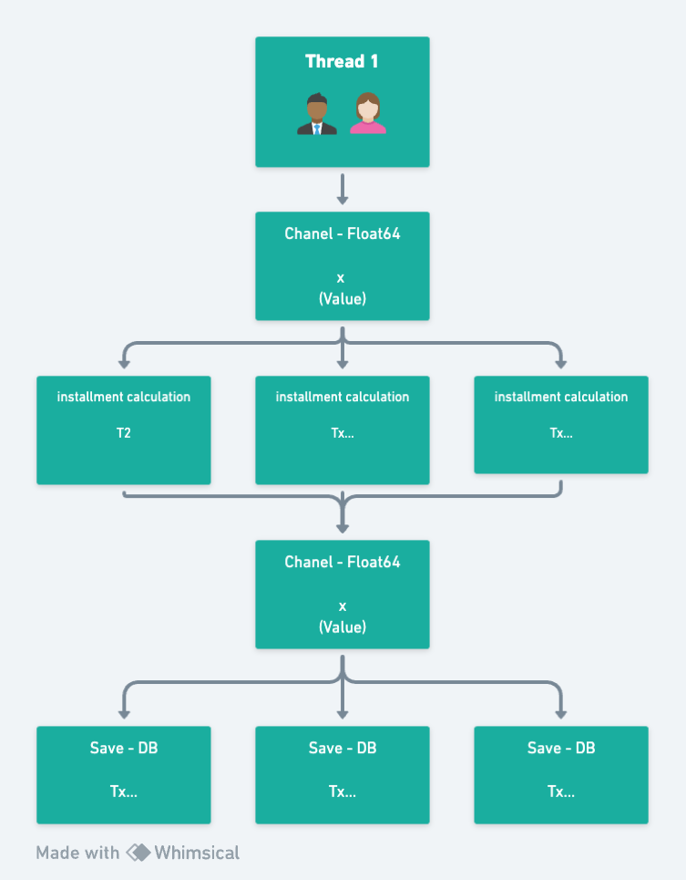
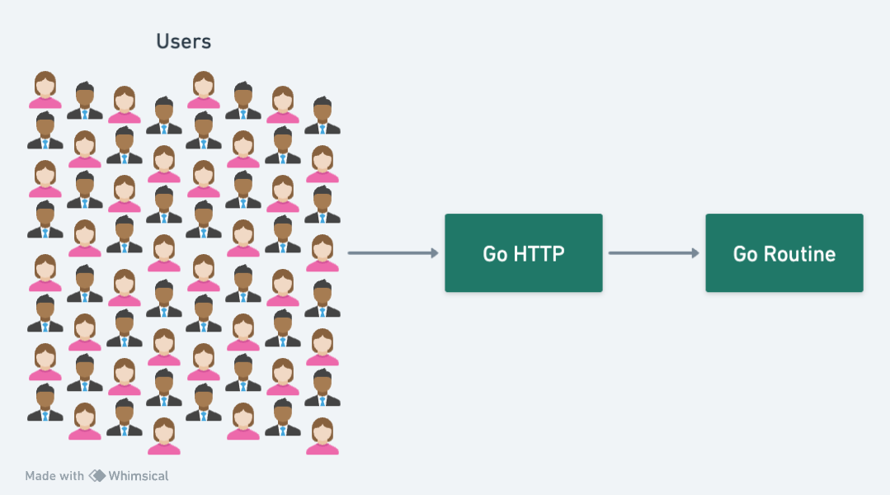

# Go - Golang

This repository was created to study Golang concepts including GoRoutines, testing, database (sqlite3), RabbitMQ, docker and K8S (Kubernetes)

<br>


[First class](https://www.youtube.com/watch?v=_vs-mYavJMA)<br>
[Second class](https://www.youtube.com/watch?v=Uaws_IizYF4)<br>
[Third class](https://www.youtube.com/watch?v=8PVrWUP2HIA)


## Dependencies
<br>
<br>
<br>

## How to Use
To run the project, you must have the dependencies installed, then run the commands below

> remember to clone db.sqlite3 to the location of the file being executed

### Run on Windows

To execute the API run the command below
> The API run on 8888 port <br/>
> To access the API use the URL: **http://localhost:8888/order** <br/>
> Method: POST <br/>
> Body: {price: 10.00, tax: 1.5} <br/>

```
  go run cmd/api/main.go
```
OR execute the executable file
```
  cmd/api/api.exe
```

To execute the consumer for rabbitMQ run the command below
> To run the rabbitMQ with docker run the command: **docker-compose up -d** <br/>
> To access rabbitMQ management open the link: **http://localhost:15672** <br/>
> User: guest <br/>
> Password: guest
```
  go run cmd/order/main.go
```

### Run on Unix (Linux and Mac)

Ned to have Golang installed
To execute the API run the command below
> The API run on 8888 port <br/>
> To access the API use the URL: **http://localhost:8888/order** <br/>
> Method: POST <br/>
> Body: {price: 10.00, tax: 1.5} <br/>
```
  make go_api
```
OR
```
  go run cmd/api/main.go
```

To execute the consumer for rabbitMQ run the command below
> To run the rabbitMQ with docker run the command: **docker-compose up -d** <br/>
> To access rabbitMQ management open the link: **http://localhost:15672** <br/>
> User: guest <br/>
> Password: guest
```
  make go_msg
```
OR
```
  go run cmd/order/main.go
```

To execute the project with k8s run the command below (need to have kind installed)
```
  make k8s_up
```

> This command will create the cluster, pod and service

To clear the project with k8s run the command below
```
  make k8s_down
```
> This command will delete the cluster, the pod and the service that was created

## Go Tips

### Go Routines

Go has its own Threads, which are known as Go Routines: Co-Routines / userland / light threads / green and consume 2kb of memory


### Go Channels

Go Channels was created to solve race conditions

#### Race Conditions
Race condition is a common problem that occurs in concurrent programming, where two threads modify the same resource simultaneously, which can generate unexpected results.


## 

## 

## 

### start project
```
  go mod init github.com/gustavohenriquess/go-intensive23
```

### Test project
```
  go test ./...
```

### Install packages
```
  go mod tidy
```

### Close DB
```
  defer db.Close()
```
defer is used to perform the action after the function that called it returns


# Kubernets

### Create Cluster with Kind
```
  kind create cluster
```

### Get cluster information
```
  kubectl cluster-info
```

### View the nodes
```
  kubectl get nodes
```

### Create the Pod
```
  kubectl create -f pod.yaml
```

### Delete the Pod
```
  kubectl delete -f pod.yaml
```

### View Pods
```
  kubectl get pods
```

### View Pods in more detail
```
  kubectl get pods -o wide
```

### Create a service
```
  kubectl create -f service.yaml
```

### View services
```
  kubectl get svc
```

### View services in more detail
```
  kubectl get svc -o wide
```

### Delete the service
```
  kubectl delete -f service.yaml
```


### Run the service locally
```
  kubectl port-forward svc/goapp-service 8888:8888
```
